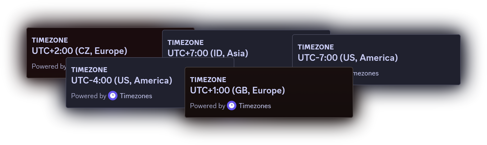

    
    <h1>Timezone Bot</h1>

**Timezone Bot** (or **Timezones**) is _an open-source Discord bot which gives your members the ability to pin their timezone to their profile._

**Timezones** can be added to your Discord server [here](https://discord.com/api/oauth2/authorize?client_id=1107722770248384654&permissions=268435456&scope=bot%20applications.commands)

  

# Command Documentation

**`/timezone info`** — shows general information about the bot and how to use it  
~~**`/timezone setup`** — creates a preset **Timezones** role to your server~~  
**`/timezone check [@user]`** — shows you someone's set timezone
**`/timezone update`** — prompts you to update your timezone  
**`/timezone remove`** — removes your timezone from your profile

# Setting Up

After adding **Timezones** to your server, simply run the **`/timezone setup`** command to create a preset role with **Timezones** linked!
Or, if you want to setup **Timezones** manually:

1. Create a new role and call it whatever you want (role name _must_ include `**timezone**` in order for the bot to recognize it)
2. Go to the Links tab > Add requirement > select **Timezones**
3. You're all done! Now head to your server's Linked Roles and you'll see timezones available

> ### **💡 Tip**
>
> If you own a big Discord server, make sure to let your members know how **Timezones** works!

# Hosting Timezones Yourself

Hosting **Timezones** yourself isn't the easiest thing to do, but if you're feeling brave you can follow [this tutorial](./SELFHOSTING.md)!
